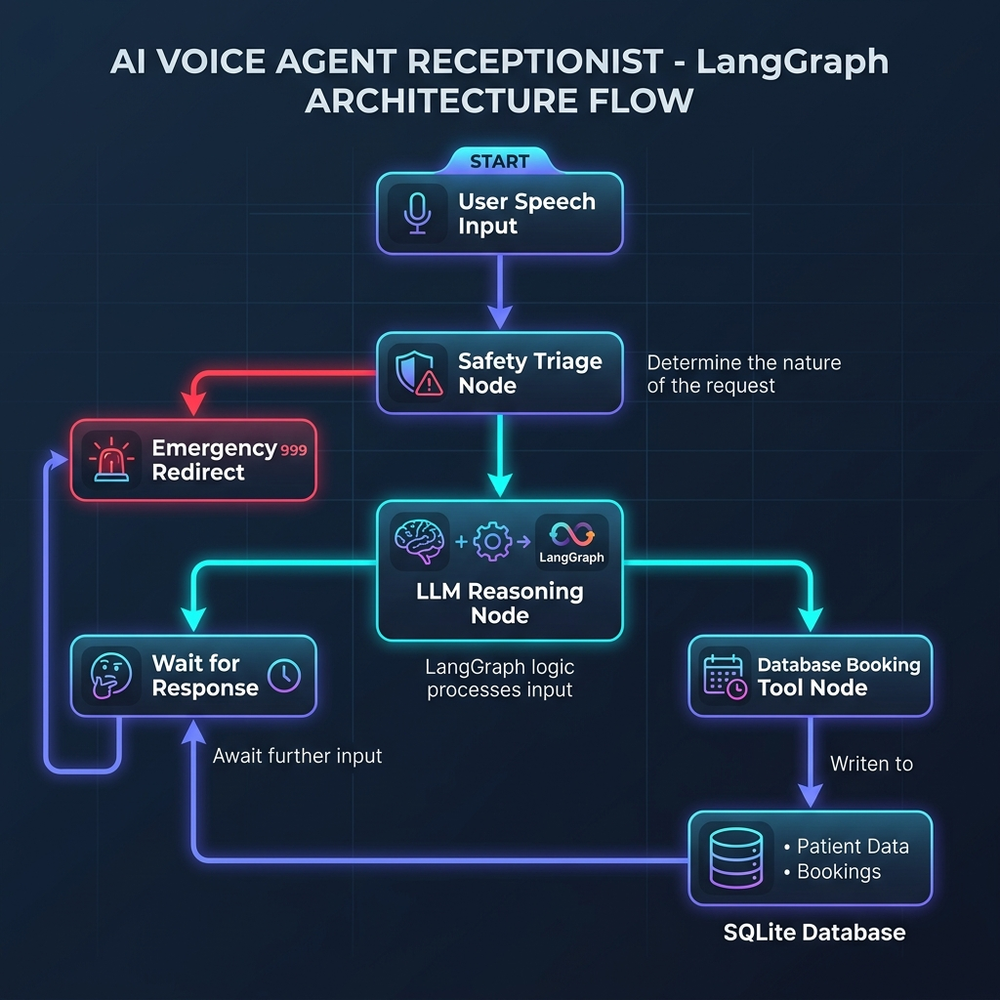
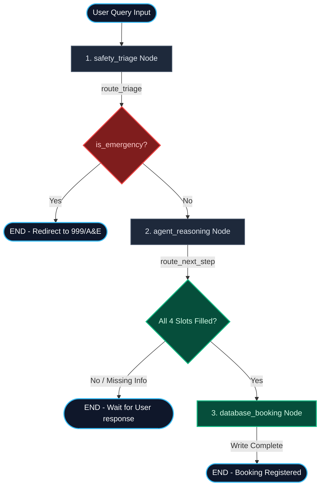

# LangGraph State Flow Workflow

This document explains the architecture of the **LangGraph Voice Agent** using a state graph workflow. You can view the rendered graph in any Markdown viewer (like VS Code's Markdown Preview).

---

## 1. Visual System Architecture Diagram

---

## 2. Visual Flow Diagram (Mermaid)

---

## 2. Graph Components Explained

### A. Graph State
The graph carries a single dict state throughout its nodes:
* `messages`: Appends all user messages and bot responses (converts speech to text).
* `patient_name`, `patient_dob`, `doctor_name`, `appointment_reason`: Slot values gathered during the conversation.
* `is_emergency`: Set to `True` if critical symptoms are flagged.
* `booking_status`: Set to `"Success"` or `"Failed"` after database node execution.

### B. The Nodes (Action Steps)
1. **`safety_triage` Node:** Evaluates the last user message. If emergency symptoms are detected, sets `is_emergency = True` and inserts the emergency warning message.
2. **`agent_reasoning` Node:** The core LLM node. It evaluates the current slot states, prompts the user for missing details, and generates a conversational response.
3. **`database_booking` Node:** The tool/action node. Once all info is ready, it writes the appointment to the SQLite database.

### C. The Routers (Conditional Edges)
* **`route_triage`:** Inspects the safety state. If `is_emergency` is true, it terminates the graph immediately (bypassing the LLM).
* **`route_next_step`:** Compares current slot-filling progress. If all fields are collected, it routes to `database_booking`; otherwise, it returns control to the user (waits for their reply).
